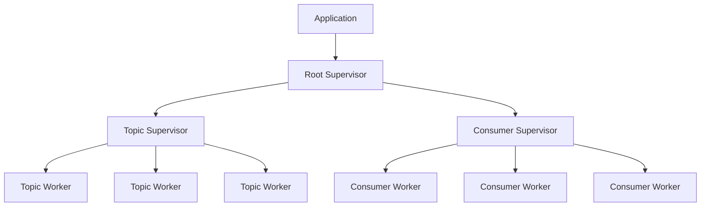

## System diagram

```mermaid
flowchart TD
    App["Application"]

    App --> Root["Root Supervisor"]

    Root --> TopicSup["Topic Supervisor"]
    Root --> ConsumerSup["Consumer Supervisor"]

    TopicSup --> T1["Topic Worker"]
    TopicSup --> T2["Topic Worker"]
    TopicSup --> TN["Topic Worker"]

    ConsumerSup --> C1["Consumer Worker"]
    ConsumerSup --> C2["Consumer Worker"]
    ConsumerSup --> CN["Consumer Worker"]
```
