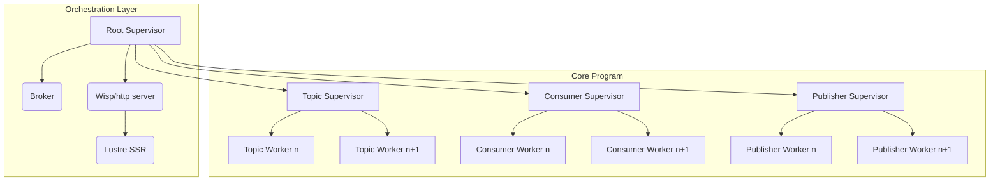

## System diagram

```mermaid
flowchart TD
    subgraph orchestration[Orchestration Layer]
        Root[Root Supervisor]

        Root --> Broker(Broker)
        Root --> Wisp(Wisp/http server)
        Wisp --> Lustre(Lustre SSR)
    end

    subgraph core[Core Program]
        Root --> TopicSup[Topic Supervisor]
        Root --> ConsumerSup[Consumer Supervisor]
        Root --> PublisherSup[Publisher Supervisor]

        TopicSup --> T1[Topic Worker n]
        TopicSup --> T2[Topic Worker n+1]

        ConsumerSup --> C1[Consumer Worker n]
        ConsumerSup --> C2[Consumer Worker n+1]

        PublisherSup --> S1[Publisher Worker n]
        PublisherSup --> S2[Publisher Worker n+1]
    end
```
